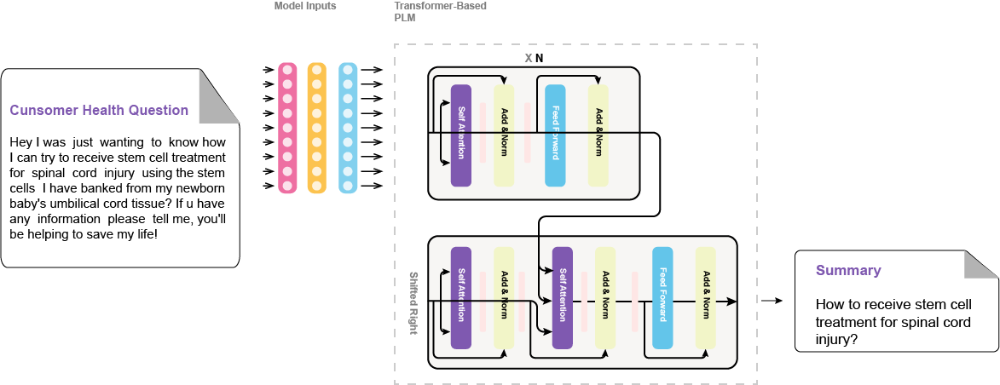

# MedQSum
Welcome to the MedQSum repository! This GitHub repository presents the code source of our paper "**[Enhancing Large Language Models' Utility for Medical Question-Answering: A Patient Health Question Summarization Approach]()**", which introduces a solution to get the most out of LLMs, when answering health-related questions. We address the challenge of crafting accurate prompts by summarizing consumer health questions (CHQs) to generate clear and concise medical questions. Our approach involves fine-tuning Transformer-based models, including Flan-T5 in resource-constrained environments and three medical question summarization datasets.

## Datasets
To fine-tune and evaluate our models, we utilize three question summarization datasets:

| Dataset  | Reference                                                        | Examples | Download                    | Comments         |
|:--------:|:----------------------------------------------------------------:|:--------:|:---------------------------:|:----------------:|
| MeQ-Sum  | [Asma Ben Abacha et al](https://aclanthology.org/P19-1215/)      | 1000     | [download](./data/meq_sum/) |                  |
| HCM      | [Khalil Mrini et al](https://aclanthology.org/2021.bionlp-1.28/) | 1643     | [download](./data/hcm_sum/) |                  |
| CHQ-Summ | [Shweta Yadav et al](https://arxiv.org/abs/2206.06581)           | 1507     | [download](./data/chq_sum/) | 693 examples were used as outlined [here](https://github.com/shwetanlp/Yahoo-CHQ-Summ#data-preparation) |

## MedQSum Architecture
Our implemented models undergo fine-tuning using the following architecture:

<p align="center">
      
</p>

## Results
We present the validation results of our fine-tuned models for question summarization across three diverse datasets:

| Dataset | Model                  | R-1    | R-2    | R-L    | R-L-SUM |
|---------|------------------------|--------|--------|--------|---------|
| MeQ-Sum | T5 Base                | 41.78  | 25.88  | 39.90  | 39.97   |
|         | BART Large XSum        | 50.76* | 33.94* | 48.87* | 48.83*  |
|         | Pegasus XSum           | 46.59  | 30.46  | 44.60  | 44.78   |
|         | Flan-T5 XXL            | 45.74  | 24.87  | 43.16  | 43.09   |
| HCM     | T5 Base                | 38.49  | 19.82  | 37.64  | 37.71   |
|         | BART Large XSum        | 38.50  | 21.86* | 37.64  | 37.67   |
|         | Pegasus XSum           | 38.68* | 21.48  | 38.24* | 38.20*  |
|         | Flan-T5 XXL            | 38.34  | 19.35  | 36.94  | 36.89   |
| CHQ-Summ| T5 Base                | 38.31  | 20.36  | 36.05  | 36.10   |
|         | BART Large XSum        | 39.95* | 20.43* | 37.46* | 37.36*  |
|         | Pegasus XSum           | 37.16  | 18.76  | 34.96  | 34.86   |
|         | Flan-T5 XXL            | 36.78  | 17.02  | 35.08  | 35.05   |
| MeQ+HCM | T5 Base                | 37.90  | 20.11  | 36.75  | 36.75   |
|         | BART Large XSum        | 41.39* | 24.12* | 40.24* | 40.23*  |
|         | Pegasus XSum           | 41.14  | 22.13  | 40.03  | 39.96   |
|         | Flan-T5 XXL            | 41.31  | 22.41  | 39.74  | 39.73   |
| MeQ+HCM+CHQ | T5 Base            | 37.22  | 18.58  | 35.93  | 35.88   |
|            | BART Large XSum     | 41.10  | 23.06  | 39.17  | 39.20   |
|            | Pegasus XSum        | 41.66  | 23.51* | 40.27  | 40.32   |
|            | Flan-T5 XXL         | 42.69* | 23.28  | 40.88* | 40.87*  |


We also present ablation results demonstrating the effects of generative configuration choices and instruction fine-tuning on the [MeQ-Sum](./data/meq_sum/) dataset:

| Model                                                   | R-1   | R-2   | R-L   | R-L-SUM |
|---------------------------------------------------------|-------|-------|-------|---------|
| Flan-T5 Standard Fine-tuning                            | 45.74 | 24.87 | 43.16 | 43.09   |
| Flan-T5 Instruction Fine-Tuning                         | 46.94*| 27.09*| 43.40*| 43.72*  |
| BART Large XSum                                         | 50.76 | 33.94 | 48.87 | 48.83   |
| BART Large XSum (top_p=.95, top_k=50, and temp.=.6)     | 54.32*| 38.08*| 51.98*| 51.99*  |

## Getting Started
#### Repository Cloning
To get started, clone the repository to your environment using the following command:

```bash
git clone https://github.com/zekaouinoureddine/MedQSum.git
```

#### Requirements
Ensure that you have Python 3 installed, along with the necessary dependencies. You can install the dependencies using the provided requirements.txt file:

```bash
pip install -r requirements.txt
```

#### Models Fine-Tuning
To fine-tune our implemented models and reproduce the results. Navigate to the source code directory with `cd src`, and execute the following command. Make sure to customize file paths and adjust parameters according to your specific requirements.

```bash
python train.py \
      --train_data_path ../data/meq_sum/train.json \
      --valid_data_path ../data/meq_sum/valid.json \
      --train_batch_size 4 \
      --valid_batch_size 4 \
      --lr 3e-5 \
      --epochs 4 \
      --device cuda \
      --chq_max_len 382 \
      --sum_max_len 32 \
      --model_checkpoint facebook/bart-large-xsum
      --use_instruction False \
      --model_path ./output/medqsm.bin
```

#### Inference
To do inference and create an understandable CHQ, use this command with your own configuration.

```bash
python inference.py \
      --model_checkpoint facebook/bart-large-xsum \
      --chq_max_len 384 \
      --input_chq_text Type your CHQ input text \
      --device cuda \
```

<!-- ### Cite Us
If you are using this repository's code for your reseach work, please cite our paper:

```
@proceedings{
    author = {Nour Eddine Zekaoui and Siham Yousfi and Mounia Mikram and Maryem Rhanoui},
    title = {Enhancing Large Language Models’ Utility for Medical Question-Answering: A Patient Health Question Summarization Approach},
    booktitle = {IEEE SITA 2023 Conference},
    year = {2023},
    month = {Oct},
    doi = {},
    url = {},
}
``` -->

## Contact
For help or issues using the paper's code, please submit a GitHub **[issue](https://github.com/zekaouinoureddine/MedQSum/issues)**. For personal communication related to the paper, please contact: `{nour-eddine.zekaoui, syousfi, mmikram, mrhanoui}@esi.ac.ma`.

---
> If you like it, give it a ⭐, then follow me on:
> - LinkedIn: [Nour Eddine ZEKAOUI](https://www.linkedin.com/in/nour-eddine-zekaoui-ba43b1177/)
> - Twitter: [@NZekaoui](https://twitter.com/NZekaoui)